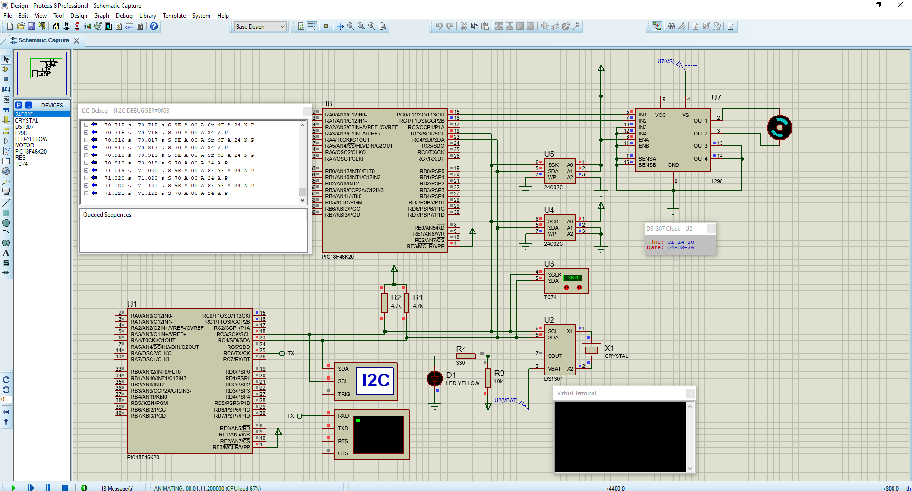

# Smart Home Embedded System

**Final Project – Interfacing with 8-Bit Microcontrollers**

**280-Hour Embedded Systems Diploma**

**Completed: September 2024**

---

## Overview

This repository contains the final project of the **Interfacing with 8-Bit Microcontrollers** module, completed as part of a **280-hour Embedded Systems Diploma**.

The project demonstrates the development of a Smart Home embedded system based on the **PIC18F46K20** microcontroller. It integrates multiple peripherals and communication protocols, including **UART**, **I²C**, **EEPROM**, **RTC**, temperature sensing and motor control. The complete system was designed and validated in **Proteus** before hardware implementation.

The Smart Home application uses the **MPLAB Code Configurator (MCC)** for peripheral initialization on the PIC18F46K20.

Besides the final project, this repository also contains the **self-written embedded drivers** developed throughout the diploma. These drivers are located in **`Diploma/application.X/`** and demonstrate manual implementation of embedded peripherals without using MCC.

---

## Objectives

- Develop a Smart Home application using the PIC18F46K20
- Implement communication using UART and I²C
- Interface external peripherals and sensors
- Store persistent data using external EEPROM
- Read date and time from a DS1307 RTC
- Automatically control a cooling fan based on temperature measurements
- Validate the complete embedded system using Proteus simulation

---

## Features

- PIC18F46K20 microcontroller
- Embedded C
- MPLAB X IDE
- MPLAB Code Configurator (MCC)
- Proteus Professional simulation
- UART (EUSART)
- I²C (MSSP)
- DS1307 Real-Time Clock
- TC74 temperature sensor
- 2 × 24C02 EEPROM
- L298 motor driver
- DC motor (cooling fan)
- Persistent EEPROM storage
- UART terminal monitoring

---

## System Overview

The Smart Home system continuously monitors the ambient temperature using a **TC74 digital temperature sensor**.

When the measured temperature exceeds the predefined threshold (**35 °C**), the master microcontroller sends a command through the **I²C bus** to a second microcontroller operating in slave mode. The slave activates a **DC motor** through an **L298 motor driver**, representing an automatic cooling fan.

The system also communicates with:

- DS1307 RTC for date and time
- External EEPROM devices for persistent configuration storage
- PC through UART for monitoring and debugging

---

## Hardware

### Microcontroller

- PIC18F46K20

### Communication

- UART (EUSART)
- I²C (MSSP)

### Sensors

- TC74 Temperature Sensor
- DS1307 Real-Time Clock

### Memory

- 2 × 24C02 EEPROM

### Actuator

- L298 Motor Driver
- DC Motor (Cooling Fan)

---

## Software

### Programming Language

- Embedded C

### Development Environment

- MPLAB X IDE
- MPLAB Code Configurator (MCC)
- Proteus Professional

---

## Proteus Simulation

The complete Smart Home application was designed, tested and validated using **Proteus Professional** before deployment on physical hardware.

### System Simulation

<p align="center">

</p>

---

## Embedded Driver Library

In addition to the Smart Home application, this repository contains the embedded software developed throughout the **Interfacing with 8-Bit Microcontrollers** module.

The source code follows a layered software architecture consisting of:

- **MCAL (Microcontroller Abstraction Layer)** for low-level peripheral drivers
- **ECU Layer** for reusable hardware abstraction modules

Unlike the Smart Home application, which uses **MPLAB Code Configurator (MCC)**, the drivers inside **`Diploma/application.X`** were implemented manually to gain a deeper understanding of low-level embedded software development.

### MCAL Layer

The MCAL layer contains drivers for:

- GPIO
- External Interrupts
- Timer0 – Timer3
- ADC
- CCP (PWM)
- USART
- MSSP (I²C)
- MSSP (SPI)
- Internal EEPROM

### ECU Layer

The ECU layer contains reusable drivers for:

- LED
- Push Button
- Relay
- DC Motor
- 7-Segment
- Character LCD
- Keypad

---

## Technologies

### Programming

- Embedded C

### IDE & Development

- MPLAB X IDE
- MPLAB Code Configurator (MCC)

### Simulation

- Proteus Professional

### Microcontrollers

- PIC18F46K20
- PIC18F4620

### Communication

- UART (EUSART)
- I²C (MSSP)
- SPI (MSSP)

### Embedded Software

- MCAL
- ECU Layer
- Layered Software Architecture

### Peripherals

- EEPROM
- RTC
- ADC
- CCP (PWM)

---

## Project Status

🚧 This repository is under active development.

Additional Smart Home features, embedded software modules and hardware peripherals will be integrated over time while maintaining a modular and reusable software architecture.

---

## Roadmap

Planned future developments include:

- Password-protected access using a keypad
- LCD-based user interface for real-time system monitoring
- Automatic lighting control using an LDR with the ADC module
- PWM-based fan speed control using the CCP module
- Timer-based task scheduling
- Integration of additional Smart Home sensors and actuators

---

## Repository Structure

```text
Smart-Home-Embedded-System/
│
├── README.md
│
├── SmartHome_Project/
│   ├── application.X/
│   └── Proteus/
│
├── Diploma/
│   └── application.X/
│       ├── MCAL_Layer/
│       └── ECU_Layer/
│
├── images/
│   ├── proteus_overview.png
│   ├── simulation_running.png
│   └── hardware.jpg
│
└── videos/
    └── smart_home_demo.mp4
```

---

## Documentation

The project documentation, source code and Proteus simulation files are included in this repository.

---

## Author

**Ali Elbaradie**

M.Sc. Mechanical Engineering (Mechatronics)

University of Duisburg-Essen
